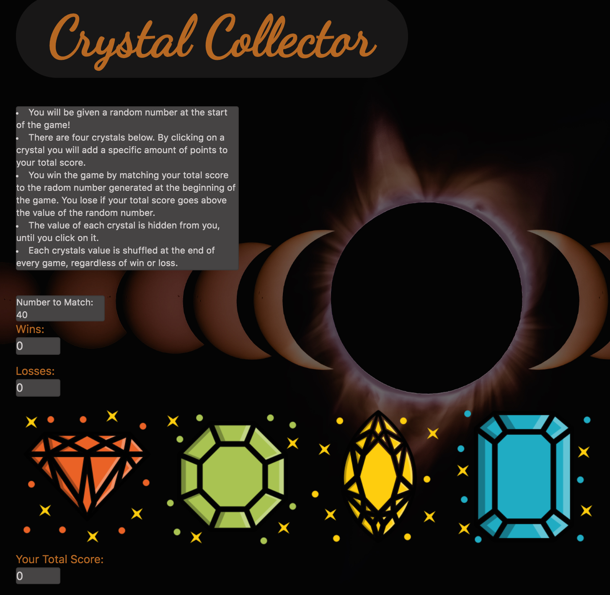

# Crystal Collector

## Clickable game, where users try to calculate the value of each crystal when clicked, and have the summation of crystal clicks equal out to the given random value.

### Functional Process of App
******************************

******************************

## How To
- Generate a random number to be matched
- Offer 4 user input options whose number value is randomized each game and hidden from view
- Write a running tally of points added by each click of the user's guess
- Display a success or failure message for exactly matching the target number
- Keep a tally of games won and games lost 

## Technologies Used

- HTML, Bootstrap, CSS
- JavaScript, jQuery, AJAX

